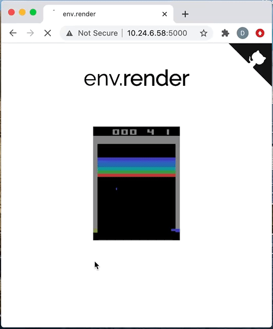

# Render Gym Environments to a Web Browser.

While working on a head-less server, it can be a little tricky to render and see your environment simulation. This script allows you to render your environment onto a browser by just adding one line to your code.

## Installation
```shell
xvfb-run -s "-screen 0 1400x900x24" bash # Run this if you're using a head-less server.
pip3 install render_browser
```
Or you can install from the source by cloning this repo and running `pip3 install .`.

## Usage
Put your code in a function and replace your normal `env.render()` with `yield env.render(mode='rgb_array')`. Encapsulate this function with the `render_browser` decorator.

```python
import gym
from render_browser import render_browser

@render_browser
def test_policy(policy):
    # Your function/code here.
    env = gym.make('Breakout-v0')
    obs = env.reset()

    while True:
        yield env.render(mode='rgb_array')
        # ... run policy ...
        obs, rew, _, _ = env.step(action)

test_policy(policy)    
```

When you visit `your_ip:5000` on your browser, `test_policy()` will be called and you'll be able to see the rendered environment on your browser window.  



## TODO
+ Stop flask server once the rendering stops - so that render_browser can be called more than once in a single run.
+ Allow I/P from keyboard on the browser, useful for teleoperation in robotic environments.
